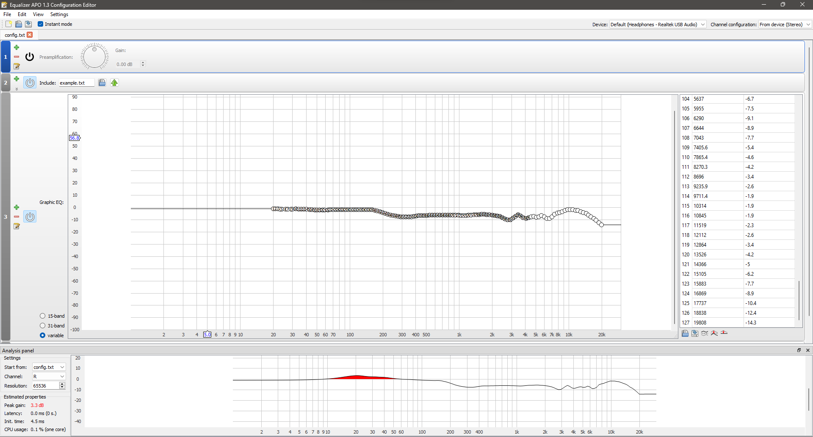
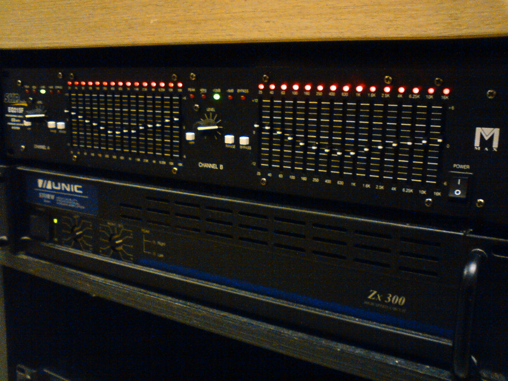
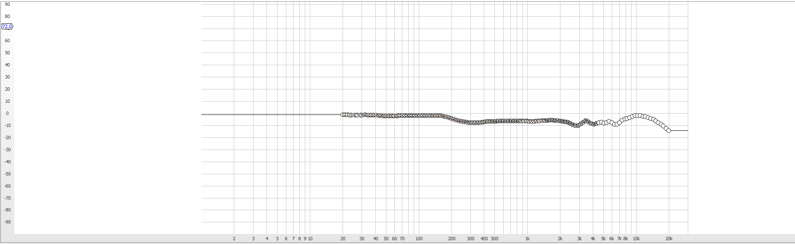

# Equalizing Headphones to sound better

Any time I get a new pair of headphones I use [Equalizer APO](https://sourceforge.net/projects/equalizerapo/) to make them sound better. All headphones have a difference in their [sound signature](https://www.audio-technica.com/en-au/support/a-simple-guide-to-sound-signatures) with some focusing on bass, others on treble, and some with a balance across the board. Out of the box my current headphones had a huge emphasis on treble, on games it was ok but when I used them for music it was almost unbearable. I prefer to have a balanced sound, so I used Equalizer APO to adjust the sound to my liking.

To simplify the process of setting up Equalizer APO, I use [AutoEQ](https://github.com/jaakkopasanen/AutoEq) which generates a configuration based on the model and brand of headphone used and real time edits you make as you test out the settings. The first time I did this process it was as smooth as it could be. Launching Equalizer APO greets you with this screen:

Right off the bat, it can be seen that there is **visibility of system status** it shows the estimated peak gain, latency, init time and CPU usage as well as the modules that are switched on. It helps the user, me, see how much of my CPU resource the audio processing is taking up the latency shows how the applied settings will affect the output time of the audio, this matters because since this eq is meant to be system wide it is important to know if there will be a delay in output it helps me make sure that the audio processing will not affect my system performance as I make changes.

[source](https://en.wikipedia.org/wiki/Equalization_(audio))

Equalizer APO **matches the system with the real world** with the knobs and sliders used like those on an anolog equalizer like shown in the images above. For me, someone that has very little experience with a physical equalizer, I've only played around with one when I did technical theatre work in highschool. This is familiar, **memorable** everytime I open the application I know what knob to turn to amplify and in setting this up I was able to do so with the little knowledge I had. 

There are only two ways a knob can go, and 4 ways a slider can go in the case of a digital EQ but the concept is the same to that of a physical EQ. Slide the sliders up, and it boosts a frequency slide it down and it does the opposite. Turn a knob right and it amplifies, turn it left and it does the opposite. Maintance of this standard helped me understand and made this **learnable** which allowed me to learn more about the interactions.

In the case that I accidentally turned a knob too far, or maxed a slider out so much that it caused audio artifacts, which did happen. The software has **error recognition and recovery** mechanisms one of which is the ability to shut off the equalizer and reset it to default settings. In one instance I turned the preamp knob high with an active eq and it caused issues with CPU usage and peak gain which resulted in distorted audio. I was able to revert back to my previous settings and start all over. despite the interface being simple, it does adopt ideas that helped me set up the eq effectively.
